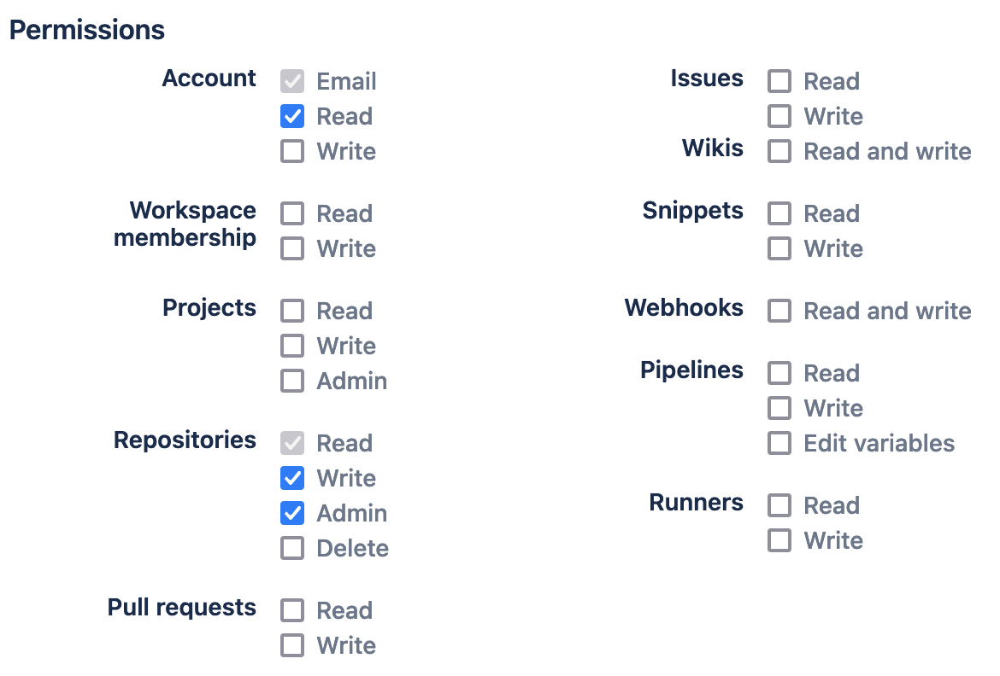

Mirrors a GitHub Git repository to Bitbucket. If no corresponding Bitbucket repository exists, it is created using the [Bitbucket API 2.0](https://developer.atlassian.com/bitbucket/api/2/reference/).

**Please note**: make sure that you checkout the entire repository before using this. By default, `actions/checkout@v2` only creates a shallow clone. See section [example usage](#example-usage) on how to do a complete clone.

## Required Inputs

### `password`
Password to use on Bitbucket for authentication and for pushing. **Create a new [App Password](https://bitbucket.org/account/settings/app-passwords/) with the following permissions:**

## Optional Inputs
### `username`
Username to use on Bitbucket for 1) authentication and as 2) workspace name. Default: GitHub user name.

### `repository`
Name of the repository on Bitbucket. If it does not exist, it is created automatically. Default: GitHub repository name.

### `spacename`
Name of the space in which the repository should be contained on Bitbucket. Default:  GitHub user name.

## Outputs
None

## Example usage

      - name: Checkout
        uses: actions/checkout@v2
        with:
          fetch-depth: 0 # <-- clone with complete history
      - name: Push
        uses: heussd/mirror-to-bitbucket-github-action@v2
        with:
          password: ${{ secrets.BITBUCKET_PASSWORD }}

## Example with all parameters

      - name: Checkout
        uses: actions/checkout@v2
        with:
          fetch-depth: 0 # <-- clone with complete history
      - name: Push
        uses: heussd/mirror-to-bitbucket-github-action@v2
        with:
          username: mycrazybbusername
          spacename: teamspace
          repository: bestrepo
          password: ${{ secrets.BITBUCKET_PASSWORD }}
